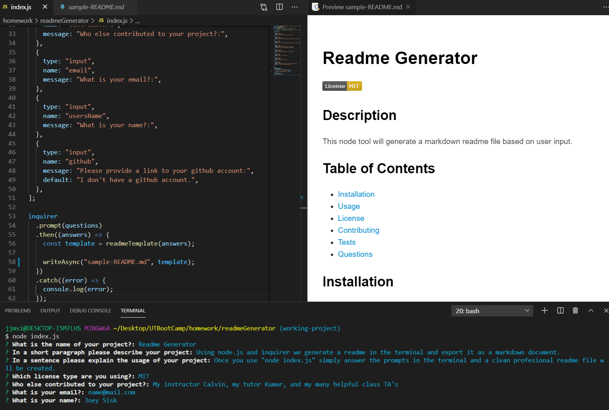

# Readme Generator
[](https://opensource.org/licenses/MIT)

## Description

This node.js based program is designed to generate a clean professional looking readme based on user input. Multiple libraries were used in this application including inquirer, fs, and util. Once the base readme is generated in markdown for the user it can still be edited and added to in order to add pictures, additional links, or details. 

## Table of Contents 

* [Screenshot](#Screenshot)

* [Installation](#installation)

* [Usage](#usage)

* [License](#license)

* [Contributing](#contributing)

* [Tests](#tests)

* [Questions](#questions)

## Screenshot



## Installation

To install necessary dependencies, run the following command:

```
npm i
```

## Usage

Once the user has installed the necessary tools it is as easy to use as typeing "node index.js" into their terminal of choice while in the parent directory and then answering the prompt questions.

## License

- MIT

- https://opensource.org/licenses/MIT
  
## Contributing

This would not have been possible without the help of my tutor Kumar Ramanathan, my instructor Calvin Carter, all of the class TA's, and many of my fellow UT Bootcamp students.

## Tests

To run tests, run the following command:

```
npm test
```

## Questions

If you have any questions about the repo, open an issue or contact me through the contact form on my portfolio website: https://joey-sisk.github.io/Portfolio/. You can find more of my work at [Joey Sisk](github.com/joey-sisk).
